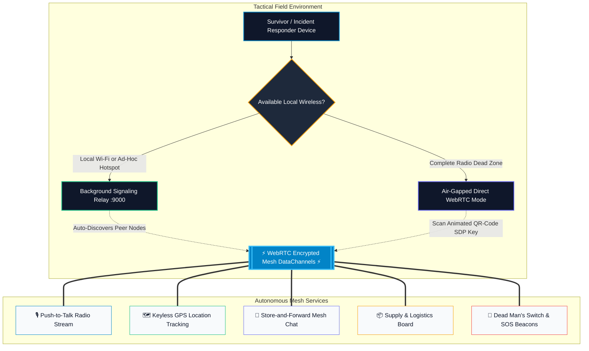

<div align="center">

# 🌐 ResQMesh — Tactical Emergency Mesh OS

**Autonomous, Decentralized & Zero-Infrastructure Survival Communications Grid**

[](https://github.com/eshwarshetty06-creator/ResQMesh)
[](https://webrtc.org/)
[](https://react.dev/)
[](https://developer.mozilla.org/en-US/docs/Web/Progressive_web_apps)

<p align="center">
  <a href="#-overview">Overview</a> •
  <a href="#-core-capabilities-bento-grid">Capabilities</a> •
  <a href="#-architecture">Architecture</a> •
  <a href="#-quick-start">Quick Start</a> •
  <a href="#-tactical-tabs">Tactical Tabs</a> •
  <a href="#-crisis-playbooks">Playbooks</a> •
  <a href="#-demo-credentials">Demo Access</a>
</p>

---

</div>

## 🚨 Overview

When catastrophic natural disasters (earthquakes, super-typhoons, tsunamis) or power grid collapses sever commercial cell towers, fiber cables, and internet service providers, **connectivity is the first casualty**.

**ResQMesh** turns standard laptops, smartphones, and tablets into an autonomous, encrypted peer-to-peer survival network straight inside any modern web browser. **Zero cellular network, zero internet service, and zero external cloud servers are required in the field.**

Using high-performance **WebRTC DataChannels**, **Opus Audio Compression**, and **Store-and-Forward multi-hop routing**, ResQMesh bridges isolated survivors and tactical first responders across hostile environments.

---

## ⚡ Core Capabilities (Bento Grid)

<table>
  <tr>
    <td width="50%">
      <h3>🎙️ Sub-Second Push-To-Talk Radio</h3>
      <p>Instant digital walkie-talkie mode. Encodes voice bursts via Opus codec and streams binary audio across the local mesh network with sub-50ms latency. No cellular minutes or radio frequencies required.</p>
    </td>
    <td width="50%">
      <h3>🌐 Autonomous WebRTC Mesh</h3>
      <p>Direct browser-to-browser data channels with resilient store-and-forward queueing. Critical distress signals queue locally in device memory and automatically dispatch when a peer comes within proximity.</p>
    </td>
  </tr>
  <tr>
    <td width="50%">
      <h3>🗺️ Keyless Tactical Cartography</h3>
      <p>Natural light OpenStreetMap street cartography and high-resolution Esri satellite imagery with zero API keys or rate limits. Real-time GPS coordinate broadcasting, breadcrumb trails, and survivor tracking.</p>
    </td>
    <td width="50%">
      <h3>🚨 Dead Man's Switch (DMS)</h3>
      <p>Essential safety protocol for solitary responders entering collapsed buildings or hazard zones. An automated failsafe timer broadcasts an emergency beacon to the entire mesh if the responder becomes unresponsive.</p>
    </td>
  </tr>
  <tr>
    <td width="50%">
      <h3>📦 Decentralized Logistics Board</h3>
      <p>Peer-to-peer resource exchange board. Match requests and offers for potable water, blood units, triage medical supplies, rations, and rescue boats between citizens and command post personnel.</p>
    </td>
    <td width="50%">
      <h3>🫀 In-Browser Biometric PPG Scanner</h3>
      <p>Estimate survivor heart rate (BPM) and vitals directly through the device camera lens using optical photoplethysmography (PPG) without requiring external medical hardware.</p>
    </td>
  </tr>
</table>

---

## 🏛️ System Architecture

ResQMesh operates across two operational tiers depending on available connectivity:



---

## 🎯 Tactical Application Views

1. **Commercial Landing Page (`/`)**:
   - Modern glassmorphic command header with live network indicator (`● RELAY 9000 ONLINE`).
   - Interactive live **Mesh Topology Simulator** with dynamic packet hopping waves.
   - 1-Click Fast Demo Launchers (`Civilian SOS` vs `Incident Commander`).
   - Crisis Scenario Playbooks & Objective Telecom Comparison Matrix.
2. **Central Command Dashboard**:
   - Live node connection radar with real-time ping latency.
   - Interactive SVG/Canvas biometric waveform monitor.
   - Quick launch triggers for all tactical emergency modules.
3. **Live Tactical Mesh Console (`ScenarioLive`)**:
   - **Chat**: Store-and-forward messaging with offline queueing, GPS location pins, and quick-link bar.
   - **Radio (PTT)**: Push-to-Talk audio burst broadcasting, real-time playback, and transmission logs.
   - **Map**: Natural-light OpenStreetMap and true-color Esri satellite imagery with survivor heat circles, breadcrumbs, and click-to-pin coordinate broadcasting.
   - **Supply Logistics**: Distributed bulletin board for requesting/offering food, medical supplies, water, and shelter.
   - **Tactical SOS & DMS**: One-tap emergency triggers (**Critical SOS**, **Medical Evac**, **Report Safe**) and Dead Man's Switch countdown.
   - **Direct P2P**: Routerless, air-gapped QR-code SDP exchange for zero-infrastructure environments.

---

## 📖 Crisis Scenario Playbooks

- 🌋 **Grid Blackout & Earthquake**: Cell towers lose backup battery within hours. ResQMesh hops survival signals across neighboring buildings without requiring a central router.
- 🌊 **Catastrophic Flood & Cyclone**: Fiber cables severed underwater. Rescue boats and command centers share keyless satellite maps and survivor manifest counts peer-to-peer.
- 🔥 **Wildfire Evacuation Corridor**: Smoke blocks line-of-sight communications. Voice PTT and real-time safe road waypoints broadcast peer-to-peer between fleeing vehicle convoys.
- 🏔️ **Remote Alpine Search & Rescue**: Completely out of cellular territory. Field searchers link phones using QR-code air-gapped handshakes without cell towers.

---

## 📊 Comparison Matrix

| Feature | ResQMesh (v2.4) | Cellular (4G / 5G) | Satellite Handsets (Iridium) | Analog Walkie-Talkies |
| :--- | :---: | :---: | :---: | :---: |
| **Cellular Tower Dependency** | **0% (Pure P2P)** | 100% (Fails in Blackout) | 0% | 0% |
| **Hardware Required** | **Any Phone / Laptop / Tablet** | Standard Smartphone | $800 - $1,500 Proprietary | $150 - $400 Transceiver |
| **Recurring Monthly Cost** | **$0 (Zero Cloud Fees)** | $50 - $120 / month | $60 - $200 / month | $0 |
| **Voice PTT & Keyless GPS Together** | **YES (Synchronized)** | Only if towers work | Text/Voice only | Audio only (No map) |
| **Dead Man's Switch Failsafe** | **BUILT-IN (Autonomous)** | 3rd-party app required | Select models only | None |
| **Deployment Time** | **Instant (Browser URL)** | Dependent on carrier | 10-15 min satellite lock | Manual frequency tuning |

---

## 🚀 Quick Start

### Prerequisites
- [Node.js](https://nodejs.org/) (v18+ recommended)
- Any modern web browser (Google Chrome, Microsoft Edge, Mozilla Firefox, Apple Safari)

### 1. Installation
```bash
git clone https://github.com/eshwarshetty06-creator/ResQMesh.git
cd ResQMesh
npm install
```

### 2. Run Local Offline Mesh (Recommended)
This starts both the Vite client application (`http://localhost:5173`) and the local PeerJS mesh relay (`http://localhost:9000/peerjs`) concurrently:

```bash
npm run dev:offline
```

> **Testing Multi-Device Mesh**: Open `http://<YOUR-LOCAL-IP>:5173` on multiple phones, tablets, or laptops connected to the same Wi-Fi router or mobile hotspot (even without internet connection!).

### 3. Production Build
Compile optimized, production-ready static assets:

```bash
npm run build
```

Preview the production build locally:
```bash
npm run preview
```

---

## 🔐 Instant Demo Credentials

Use these pre-configured credentials for quick evaluation or bypass:

- **Civilian Survivor Mode**:
  - Full Name: `Alex Walker`
  - Mobile: `+91 9876543210`
  - Verification Code (OTP): `1234`
  - *(Or click **"Launch as Civilian SOS"** on the landing page for 1-click instant entry!)*

- **Incident Commander Mode**:
  - Commander Alias: `Cmdr. Sarah Vance`
  - Grid Sector ID: `GRID-RESCUE-01`
  - Authorization Passcode: `admin123`
  - *(Or click **"Launch Incident Commander"** on the landing page for 1-click instant entry!)*

---

## 🌐 Cloud Deployment Options

For wide-area emergency deployments where internet edge relays are accessible:

- **Frontend App**: Deploy to [Vercel](https://vercel.com), [Cloudflare Pages](https://pages.cloudflare.com/), or [Netlify](https://netlify.com).
- **Relay Server**: Host `server.js` on [Render](https://render.com), [Railway](https://railway.app), or any Linux VPS.

**Environment Variables (`.env`):**
```env
# Cloud PeerJS Relay (Optional - local fallback runs automatically)
VITE_PEER_HOST=your-relay.onrender.com
VITE_PEER_PORT=443
VITE_PEER_PATH=/peerjs

# Firebase Phone Auth (Optional - sandbox demo OTP enabled by default)
VITE_FIREBASE_API_KEY=your_api_key
VITE_FIREBASE_AUTH_DOMAIN=res-q-mesh.firebaseapp.com
VITE_FIREBASE_PROJECT_ID=res-q-mesh
VITE_FIREBASE_STORAGE_BUCKET=res-q-mesh.appspot.com
VITE_FIREBASE_MESSAGING_SENDER_ID=your_sender_id
VITE_FIREBASE_APP_ID=your_app_id
```

---

## 🛡️ Security & Privacy

- **End-to-End Encryption**: DTLS 1.3 protocol handshake with AES-GCM 256-bit cryptography.
- **Zero Cloud Data Storage**: Peer-to-peer data packets flow directly between client devices and are never retained on central databases.
- **Air-Gap Ready**: Can run completely disconnected from the public internet using direct QR-code SDP exchanges.

---

<div align="center">
  <sub>Built with ❤️ for humanitarian crisis relief, search and rescue operations, and community resilience.</sub>
</div>
